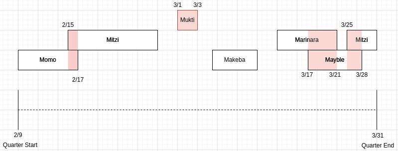

# jira-tracker

This tool is meant to be a metric generator for sites to use to track auto readiness, as part of the larger goal of achieving driver out readiness by the end of the year. It is still a WIP, as some additional features are planned to be added yet (see TODO in main file) and (most assuredly) bugs still exist.

As a disclaimer, the tool is only as good as each site's ability to update Jira tickets in a timely and accurate manner. Vehicle down (manual, grounded) states are hot ticket items, and the TSE team does a good job of monitoring these tickets -- but lots of accountability rests on each site tech, support staff, and site staff to keep on updating their fleet health through Jira. 

# Solution

First, we must define auto-readiness. This may vary from site to site. The development of this application was driven specifically with the Ann Arbor site in mind, but the config allows use across sites and fleets. For the ARB site, one hundred percent auto-readiness is no more than one Lexus vehicle down, and the GEM must not be down. Down is manual only or grounded. 

The challenge is then to use the Jira REST API to extract relevant tickets, dates, and vehicle state impact transitions. The vehicle state impact is the custom field for all Jira tickets that defines the health of the vehicle. 

To accomplish computing vehicle uptime, we can envision a timeline over an interval [start of quarter, end of quarter], or any arbitrary date range. Then over the entire date range, plot out all vehicle transitions from up to down, and vice versa. For example, take the plot below.

Here, a box is generated any time a vehicle goes down. The box's length covers the interval [down time start date, down time end date i.e. fix date]. By the definition of auto readiness above, we can easily see when the condition is violated: any time two or more Lexus boxes overlap, and anytime the WAMs (in this case Mukti) goes down. The red portions of the box indicate the time that would count against 100% auto readiness. 

To implement this, a window slides over all intervals, sorted from oldest to newest. The window consists of two intervals: the previous largest interval, and the current interval. We want to retain the larger interval in any comparison of bounding times so that we can guarantee that any current interval we are considering that has a start datetime BEFORE the previous/maximum end datetime interval will guarantee at least two simultaenous down vehicles. We also need to check if the current interval has a ending bound that is greater than previous, and update as necessary for future comparisons. We also need to retain the name of the vehicle associated with each of the two intervals, to ensure that any overlapping intervals for matching cars does not result in accrued downtime. We also need to handle the WAMs case differently - since each site currently only has one WAMs, any time a WAMs vehicle is observed for the current interval, then we need to make sure we have defined a previous maximum ending bound datetime (initially, set to the start of the quarter) and check for overlap -- but not to accrue downtime in this case, instead to make sure we do not double count downtime. For the non-WAMs vehicles, we must also keep track of all intervals resulting in accrued downtime, and compare the interval from this list with the maximum ending bound against the current start bound to check that we are not double counting certain blocks of time. 

Running these checks, we can finally pass the relevant datetimes for applicable intervals to a function that computes downtime between two dates. It is also important that we constrain this calculation so that only business days and non-holidays are included, and that we check that interval bounds do not violate the open hours for each site (e.g., if an interval ends at 8:30 PM, 30 minutes after operations have ceased, that we do not account for those 30 minutes when computing accrued downtime). 

# Environment setup:
Go to https://maymobility.atlassian.net/jira/your-work and click on the gear icon > Atlassian Account Settings > Security > Create and manage API tokens > Create API Token. Copy this token to jiraConfig.jiraToken

While you're there, make sure the email associated with your Jira account is entered, and the server name is correct, e.g. 'https://maymobility.atlassian.net/'

The JQL query that is built to search for relevant Jira tickets is constructed from the config file. Make sure you've updated that file for your site in interest!

Note, the project names in Jira are as follows (change the 'site' field to match one of these): "AA","Arlington Fleet","Indianapolis","Grand Rapids Fleet","Hiroshima Fleet". 

Open and close times are in military time.

Then, install dependencies:

pip install virtualenv

virtualenv --python=/usr/bin/python3.8 jira-tracker

cd jira-tracker

source bin/activate

pip install -r requirements.txt

Run using the python3.8 interpeter in ./bin/

Make sure main.py is executable by running sudo chmod +x main.py